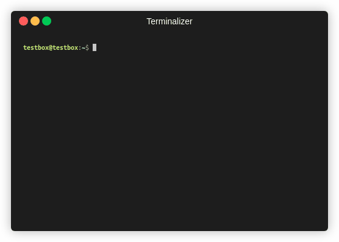

# Docker-Update-Script
Create a script to run the 4 docker commands needed to force pull/upgrade docker apps using docker-compose.  Add this to path to make an executable from anywhere command, and automate with CRON.  

This script runs the following commands in this order: pull; down; up; rmi.  One of the main benifits of this script is being able to chose to update all containers, or to only update a single container in your docker-compose, or to exclude a specific container from stopping but updating the rest.



### Prerequisites
* [docker-ce](https://docs.docker.com/engine/install/ubuntu/) installed
* [docker-compose](https://docs.docker.com/compose/install/) installed
* `docker-compose.yml` file in $HOME
  * Sample - [pastebin.com/sK9dMeet](https://pastebin.com/sK9dMeet)

# Install


### Make a userscript directory and add to PATH

* `mkdir $HOME/bin`
* `nano $HOME/.bashrc`
  * `Alt+ /` (Alt+ Forward Slash) Jump to last line.  
  * Copy and paste the below to the end of the file:  
```
if [ -d "$HOME/bin" ] ; then
    PATH="$HOME/bin:$PATH"
fi
```  
* Initialize changes:  
  `. ~/.bashrc`

---

### Create the `dup` (docker upgrade) script:

* `nano $HOME/bin/dup`

Copy the script below:

```bash
#!/bin/bash
. ~/.bashrc

# Help File
Help()
{
   # Display Help
   echo
   echo "   docker compose V2 [ Pull | Down | Up | rmi ]"
   echo
   echo -e "   Syntax: ${GREEN}dup [-h|o|e|i] [SERVICE...]${NC}"
   echo "   options:"
   echo "       -h      Print this Help."
   echo
   echo "       -i      Prints Current image list"
   echo
   echo "       -o      Only runs on a specific container"
   echo -e "               Example: ${GREEN}dup -o plex${NC} #Only update the Plex image"
   echo
   echo "       -e      Excludes a specific container"
   echo -e "               Example: ${GREEN}dup -e plex${NC} #Keeps plex running while shutting down and updating all other containers."  
   echo
   echo -e "   <none>      Updates ALL containers in ${CYAN}docker-compose.yaml${NC}"
   echo -e "               Example: ${GREEN}dup${NC}"
   echo
}

# Set Variables
ERROR_FILE="/tmp/docker-update.error"
only=''
exclude=''
service=''
CYAN='\033[0;36m'
GREEN='\033[0;32m'
NC='\033[0m' # No Color

# Get the options
while getopts "hio:e:" option; do
   case $option in
      h) # display Help
         Help
         exit;;
      o) service=${OPTARG}
	        only="True";;
      e) service=${OPTARG}
         exclude="True";;
      i) echo -e "$(docker ps -q | xargs -n 1 docker inspect --format '{{ .Name }}' | sed 's/\///')"
         exit;; 
     \?) # incorrect option
         echo "Error: Invalid option"
         exit;;
   esac
done

if [[ $only ]]
then
  echo -e "${CYAN}Pulling $service container...${NC}"
  docker compose pull $service
  echo -e "${CYAN}Stopping $service container...${NC}"
  docker compose rm -fsv $service
  echo -e "${CYAN}Starting $service container...${NC}"
  docker compose up -d --force-recreate $service
elif [[ $exclude ]]
then
  # get a list of docker images that are currently installed
  IMAGES_OUTPUT=$(docker ps -q | xargs -n 1 docker inspect --format '{{ .Name }}' | grep -v $service | grep -v "<none>" | sed 's/\///')
  for IMAGE in $IMAGES_OUTPUT; do
    echo "*****"
    echo -e "Updating $IMAGE"
    docker pull $IMAGE 2> $ERROR_FILE
    docker compose rm -sfv $IMAGE
    docker compose up -d --force-recreate $IMAGE
    if [ $? != 0 ]; then
      ERROR=$(cat $ERROR_FILE | grep "not found")
      if [ "$ERROR" != "" ]; then
        echo -e "WARNING: Docker image $IMAGE not found in repository, skipping"
      else
        echo -e "ERROR: docker pull failed on image - $IMAGE"
        exit 2
      fi
    fi
    echo "*****"
    echo
  done
else
  docker compose pull
  docker compose down
  docker compose up -d --force-recreate
fi 
echo -e "${CYAN}Deleting the old unused container images...${NC}"
docker system prune -af
echo -e "${GREEN}Successfully cleaned up${NC}"
echo -e "${GREEN}FINISHED${NC}"
```

Make the script executable:

* `chmod +x $HOME/bin/dup`

---

### Create the `aup` (apt-get update/upgrade) script:

* `nano $HOME/bin/aup`

Copy the script below:

```bash
#!/bin/bash
source $HOME/.bashrc
CYAN='\033[0;36m'
GREEN='\033[0;32m'
NC='\033[0m' # No Color

echo -e "${CYAN}apt-get update${NC}"
sudo apt-get update

echo -e "${CYAN}apt-get upgrade${NC}"
sudo apt-get upgrade -y

echo -e "${CYAN}apt-get autoremove${NC}"
sudo apt autoremove -y
echo -e "${GREEN}FINISHED${NC}"
```

Make the script executable:

* `chmod +x $HOME/bin/aup`

---

# Use

### Manual

* To update/upgrade Ubuntu, type `aup` into the terminal
* To update/upgrade ALL docker containers, type `dup` into the terminal
* To update/upgrade a specific container, type `dup -o [SERVICE...]` into the terminal
  * Ex. `dup -o plex` will only take plex down and update it.
* To keep a specific container running and update/upgrade all other containers, type `dup -e [SERVICE...]` into the terminal
  * Ex. `dup -e plex` will leave plex up and running and take down all other images to update them.

### Automated

* `crontab -e`
  * `Alt+ /` (Alt+ Forward Slash) Jump to last line.  
  * Add the two lines below, in my example it runs `dup` once a week, 6am on sat:  
```
shell=/bin/bash
0 6 * * 6 . $HOME/.bashrc; dup
```  
* Best not to automate aup, if you want automated security upgrades use a package called `unattended-upgrades`
  1. Update the server, run:  
    `aup`  
  2. Install unattended upgrades on Ubuntu:  
    `sudo apt install unattended-upgrades apt-listchanges bsd-mailx -y`  
  3. Turn on unattended security updates, run:  
    `sudo dpkg-reconfigure -plow unattended-upgrades`  
  4. Configure automatic updates, enter:  
    `sudo nano /etc/apt/apt.conf.d/50unattended-upgrades`  
    Uncomment or add the following:  
    `Unattended-Upgrade::Automatic-Reboot "true";`  
    `Unattended-Upgrade::Automatic-Reboot-WithUsers "true";`  
    `Unattended-Upgrade::Automatic-Reboot-Time "04:00";`  
  5. Verify that it is working by running the following command:  
    `sudo unattended-upgrades --dry-run --debug`  

# Notes:

* This script is compatible with pihole, I made sure to pull the new image first before stopping the container and re-creating.  Pihole is a little tricky since once you stop the pihole docker you will lose DNS and be unable to pull the :latest image, which is why we pull the image first.  
* If there are any docker containers that you do NOT want updated to the latest version, look up the available [TAG's](https://hub.docker.com/r/linuxserver/plex/tags?page=1&ordering=last_updated), then edit `docker-compose.yml` and include the specific TAG name after a `:` when defining the image.  
  * Example below locks plex to version 1.24.3:
 
```
nano docker-compose.yml
...
  plex:
    image: linuxserver/plex:1.24.3.5033-757abe6b4-ls76
...
```
